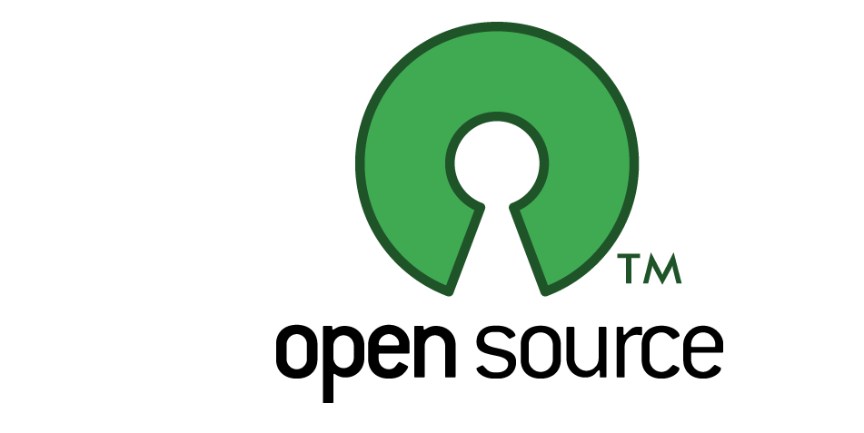

# List of Open Source Software

For more open source software visit https://sourceforge.net/

## Category
- [Audio](#audio)
- [Business/Education](#businesseducation)
- [Books](#books) - Free Books
- [Developer Tools](#developer-tools)
- [File Sharing](#file-sharing)
- [Gaming](#gaming)
- [Image](#image)
- [Operating Systems](#operating-system)
- [Video](#video)
- [Web Browsers](#web-browsers)

## Audio
- [Audacity](http://www.audacityteam.org/) - A free audio editor and recorder. 
- [Ardour](https://ardour.org/) - Record, Edit, and Mix on Linux, OS X and Windows
- [Equalizer APO](https://sourceforge.net/projects/equalizerapo/)
- [Airtime](https://www.sourcefabric.org/en/airtime/) - radio software for scheduling and remote station management.

## Business/Education
- [LibreOffice](https://www.libreoffice.org/) - microsoft office alternative
- [Apache Open Office](https://www.openoffice.org/) - The Free and Open Productivity Suite
- [Birt](http://www.eclipse.org/birt/) - An open source technology platform used to create data visualizations and reports
- [JasperReports® Library](http://community.jaspersoft.com/project/jasperreports-library) - The JasperReports is able to use data coming from any kind of data source and produce pixel-perfect documents that can be viewed, printed or exported in a variety of document formats
- [Pentaho Reporting](https://community.hds.com/docs/DOC-1009856) - Suite of Open Source reporting tools that enables the creation of relational and analytical reports from a wide range of data sources.
- [Seal Report](http://www.sealreport.org/) - an open source framework for producing reports and dashboard from any open database.
- [ReportServer](https://reportserver.net/en/) - ReportServer allows for reporting, ad-hoc analyses, Excel and Word reporting, and multidimensional OLAP analytics.
- [Helical Insight](http://helicalinsight.com/) - an open source BI framework that provides e-mail scheduling, visualization, exporting, multi-tenancy, user role management

## Books 
#### C
- [The C Book](http://publications.gbdirect.co.uk/c_book/)
- [C Element of Style](http://www.oualline.com/books.free/style/index.html)
- [The GNU C Reference Manual](https://www.gnu.org/software/gnu-c-manual/)
- [The GNU C Programming Tutorial](http://www.crasseux.com/books/ctut.pdf)
- [Essential C](http://cslibrary.stanford.edu/101/EssentialC.pdf)
- [Beej's Guide to C Programming](http://beej.us/guide/bgc/)
- [Modern C](http://icube-icps.unistra.fr/img_auth.php/d/db/ModernC.pdf)
- [An Introduction to GCC](http://www.network-theory.co.uk/docs/gccintro/)

#### C++
- [The Boost C++ Libraries](https://theboostcpplibraries.com/)
- [C++ Annotations ](http://www.icce.rug.nl/documents/cplusplus/)
- [How to Think Like a Computer Scientist ](http://greenteapress.com/thinkcpp/index.html)
- [Open Data Structures (in C++)](http://opendatastructures.org/ods-cpp/)

## Developer Tools
#### Text Editors
- [Atom](https://github.com/atom/atom)
- [Visual Studio Code](https://github.com/Microsoft/vscode)
- [Spacemacs](https://github.com/syl20bnr/spacemacs)
- [Emacs](https://www.gnu.org/software/emacs/)
- [Light Table](https://github.com/LightTable/LightTable)
- [SpaceVim](https://github.com/SpaceVim/SpaceVim)
- [Notepad++](https://notepad-plus-plus.org/)
- [SQL Operations Studio](https://github.com/Microsoft/sqlopsstudio) - SQL Operations Studio is a data management tool that enables working with SQL Server, Azure SQL DB and SQL DW from Windows, macOS and Linux.

#### IDEs
- [Code Blocks](http://www.codeblocks.org/downloads) - C, C++ and Fortran 
- [Eclipse](https://www.eclipse.org/downloads/) - C, C++, Java and PHP
- [Codelite](https://codelite.org/) - C, C++, PHP and JavaScript
- [NetBeans](https://netbeans.org/) -  Java, JavaScript, HTML5, PHP, C/C++
- [Dev C++](https://sourceforge.net/projects/orwelldevcpp/) - C/C++
- [DrJava](https://sourceforge.net/projects/drjava/?source=directory) - Java
- [Aptana](http://www.aptana.com/) - Web Development IDE
- [BlueGriffon](http://www.bluegriffon.org/) - Web and EPUB Editor
- [SeaMonkey](https://www.seamonkey-project.org/) - HTML 
- [SharpDevelop](http://www.icsharpcode.net/OpenSource/SD/Default.aspx) - The Open Source Development Environment for .NET

#### Debugger
- [x64dbg](https://x64dbg.com/#start) -  x64/x32 debugger for windows.

## File Sharing
- [qBittorrent](https://www.qbittorrent.org/) - A free and reliable P2P BitTorrent client

## Gaming
#### Open Source Games
- [List of Open Source Games](https://github.com/leereilly/games) - PC, Android, IOS
- [0 A.D.](https://github.com/0ad/0ad)
- [Craft](https://github.com/fogleman/Craft) - Minecraft clone
- [Mario SDL](https://github.com/jakowskidev/uMario_Jakowski) - SDL Mario
- [OpenRCT2](https://github.com/OpenRCT2/OpenRCT2) - Open source re-implementation of RollerCoaster Tycoon 2

#### Mincraft Alternatives
- [Minetest](https://www.minetest.net/)
- [Terasology](http://terasology.org/)
- [Craft](https://github.com/fogleman/Craft)
- [voxel.js](http://voxeljs.com/)
- [TrueCraft](https://github.com/SirCmpwn/TrueCraft) 
- [Voxelands](https://www.voxelands.com/)
- [Freeminer](https://github.com/freeminer/freeminer)

#### Engines
- [Godot](https://github.com/godotengine/godot) - Multi-platform 2D and 3D game engine
- [Ogre 3D](https://github.com/OGRECave/ogre) - scene-oriented, flexible 3D engine written in C++
- [Panda 3D](https://github.com/panda3d/panda3d) - Powerful, mature open-source cross-platform game engine for Python and C++
- [Torque 3D](https://github.com/GarageGames/Torque3D) - MIT Licensed Open Source version of Torque 3D from GarageGames
- [Irrlich](http://irrlicht.sourceforge.net/?page_id=10) - high performance realtime 3D engine written in C++

## Image
- [Gimp](https://www.gimp.org/downloads/#mirrors) - cross-platform image editor
- [Inkscape](https://inkscape.org/en/) - Inkscape is a professional vector graphics editor for Windows, Mac OS X and Linux
- [MyPaint](https://github.com/mypaint/mypaint) - simple drawing and painting program
- [Krita](https://krita.org/en/features/highlights/) - painting tool designed for concept artists, illustrators, matte and texture artists, and the VFX industry.

#### Photography
- [Darktable](http://www.darktable.org/) - darktable is an open source photography workflow application and raw developer.
- [Entangle](https://entangle-photo.org/) - allows you to tether your digital camera to your computer and enables you to control your camera completely from the computer.
- [Hugin](http://hugin.sourceforge.net/) - Hugin is a tool that allows you to stitch together photos in order to create panoramic photos.

## Operating System
- [Ubuntu](https://www.ubuntu.com/) - Popular Linux OS
- [ReactOS](https://reactos.org/) - ReactOS looks like Windows and is able to run many Windows applications. 

## Video
- [VLC](https://www.videolan.org/vlc/index.html) - cross-platform multimedia player and framework that plays most multimedia files, and various streaming protocols. 
- [Media Player Classic](https://sourceforge.net/projects/mpc-hc/?source=directory)

#### Video Editing
- [VirtualDub](http://virtualdub.org/index.html) - VirtualDub is a video capture/processing utility for 32-bit and 64-bit Windows platforms
- [Shotcut](https://www.shotcut.org) - cross-platform video editor.
- [OpenShot](http://www.openshot.org/) - an easy to use, quick to learn, and powerful video editor.
- [VidoLAN](https://www.videolan.org/vlmc/) - VideoLAN Movie Creator is a non-linear editing software for video creation
- [Kdenlive](https://kdenlive.org/)

#### Animation
- [Synfig](https://www.synfig.org/)
- [StopGo](http://makerbox.org.nz/stopgo/) - StopGo captures images from your webcam and assembles them into a video
- [Blender](https://www.blender.org/) - modeling, rigging, animation, simulation, rendering, compositing and motion tracking, even video editing and game creation.

## Web Browsers
- [Firefox](https://www.mozilla.org/en-US/firefox/) - open source Web browser
